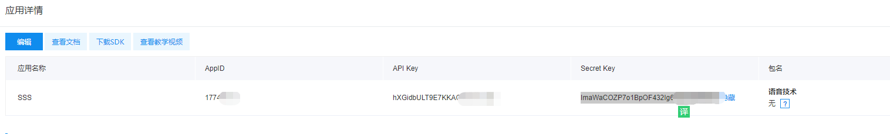

# 1 . Introduce

This is a ue4 plugin for user to easy use baidu AI TSS to convert text to voice. you can test to voice at https://ai.baidu.com/, now, the service is free but qps limited(5 qps for normal user).

# 2. Usage

##  2.1 Register the baidu accout and create application

You need to register your owned baidu accout, you can find it https://ai.baidu.com/, after you have succesful register the accout, you can get in to console and choose this

Then, you need to create your applicaiton .

After you create the application, you can jump to application info to get your owned AppID、API Key、SecretKey

## 2.2 Set in Project

After you Enable the Plugin, you can Open Project Setting And find Plugins/Text To Voice

Fill your AppID、API Key、 SecretKey and click RequestToken， If Successed, You can see the token is auto filled, otherwise please check you input or network

## 2.3 Create Sound Text Object

You can create sound object is Misc / Sound Text， now it only support chinese and english

After you created it, you can set your text in Text , you can also changed the Speed 、Intonation 、Volume Or Player Sound Fx 

After you fill your text, you can click generate voice to generate the sound, it will be in same dir of the sound text object 

After you save the file, you can change the name or move it to other dir.
